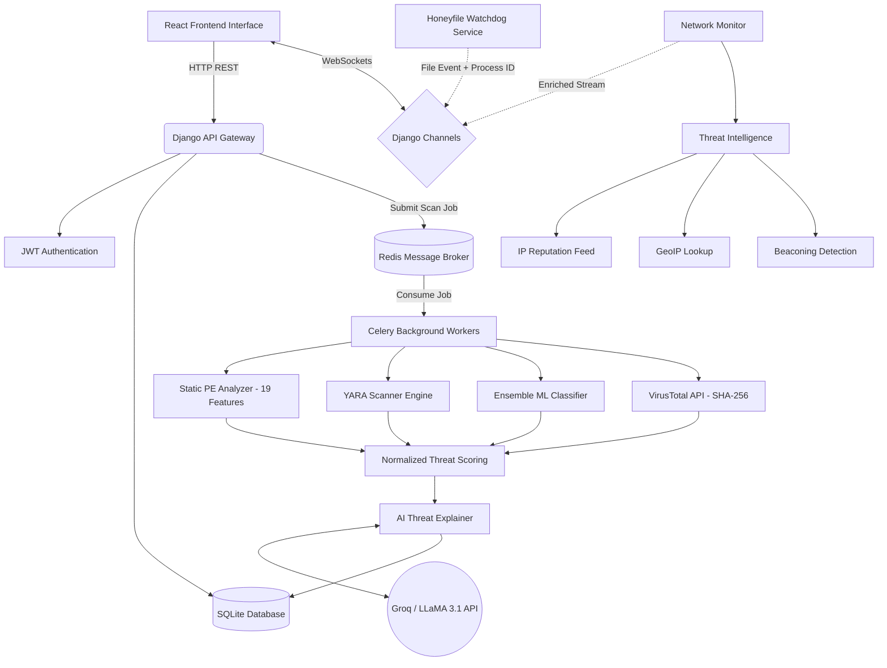

<div align="center">
  
  <h1 align="center">Ransomware Shield</h1>
  <p align="center">
    An AI-Powered, Real-Time Ransomware Detection and Mitigation Platform.
    <br />
    <a href="#key-features"><strong>Explore the features »</strong></a>
    <br />
    <br />
    <a href="#screenshots">Screenshots</a>
    ·
    <a href="#technical-architecture">Architecture</a>
    ·
    <a href="#installation">Installation</a>
  </p>
</div>

---

## 🛡️ About The Project

Ransomware Shield is a comprehensive, full-stack cybersecurity platform designed to protect endpoints from advanced ransomware and malware threats. It goes beyond traditional signature-based scanning by incorporating **Machine Learning (Ensemble Models)**, **Real-Time Honeyfile Traps with Process Attribution**, **Live Network Analysis with Threat Intelligence**, and **Generative AI Threat Explanations** to provide a multi-layered defense mechanism.

Built with a scalable Django backend, Celery task workers, and a modern React frontend, this project delivers **industry-grade static analysis** with BLAKE3 hashing, **19-feature ML classification**, and enriched **real-time network monitoring** with IP reputation, GeoIP, beaconing detection, and risk scoring.

## ✨ Key Features & Modules

### 1. 🏗️ Industry-Grade Static PE Analyzer
An advanced pipeline that analyzes Windows Executables (PE files) without executing them, extracting 19 ML-ready features.
- **BLAKE3 Multi-Hash:** Computes BLAKE3 (primary, ~14× faster), SHA-256, SHA-1, and MD5 in a single pass. SHA-256 is used for VirusTotal compatibility.
- **60+ Suspicious API Detection:** Flags commonly abused Windows APIs across 6 categories:
  - **Crypto APIs:** `BCryptEncrypt`, `CryptEncrypt`, `CryptAcquireContext`
  - **File Enumeration:** `FindFirstFile`, `FindNextFile`, `GetLogicalDriveStrings`
  - **Process Injection:** `WriteProcessMemory`, `CreateRemoteThread`, `NtUnmapViewOfSection`
  - **Anti-Debug:** `IsDebuggerPresent`, `CheckRemoteDebuggerPresent`
  - **Lateral Movement:** `NetShareEnum`, `WNetOpenEnum`
  - **Shadow Copy Deletion:** `vssadmin`, `wmic shadowcopy`
- **Ransomware String Detection:** Scans for bitcoin addresses, `.onion` URLs, ransom note keywords (`YOUR FILES`, `decrypt`, `payment`), and encryption library references.
- **Digital Signature Verification:** Checks PE files for Authenticode signatures.
- **Packer Identification:** Detects packed/obfuscated executables via section header analysis (`.upx`, `.aspack`, `.themida`).
- **Anomaly Detection:** Flags compiler timestamp anomalies, calculates per-section entropy, detects overlays, TLS callbacks, and resource anomalies.

### 2. 🧬 Thread-Safe YARA Scanner Engine
A highly optimized, thread-safe signature-matching engine.
- **Thread-Safe Caching:** Uses `threading.Lock` for safe concurrent access with individual file mtime-based cache invalidation.
- **Multi-Format Support:** Loads both `.yar` and `.yara` rule files with namespace isolation.
- **Match String Extraction:** Extracts truncated match strings (first 5 strings × 64 bytes) for detailed reporting.
- **ReDoS Protection:** Implements strict timeouts to prevent Regular Expression Denial of Service attacks.

### 3. 🧠 Ensemble ML Classifier (19 Features)
A production-grade predictive model trained on 15,000+ samples with comprehensive validation.
- **Ensemble Architecture:** Combines `GradientBoosting` + `RandomForest` classifiers via soft voting for superior accuracy.
- **19 Engineered Features:** Entropy, suspicious section/import counts, TLS callbacks, debug info, digital signature status, ransomware string count, resource entropy, overlay detection, file size ratio, and more.
- **Malware Subtypes:** Trained on ransomware, trojan, dropper, worm, and packed malware distributions.
- **Validation:** Stratified 5-fold cross-validation with **99.96% precision** and comprehensive metrics (F1, FNR, feature importance).
- **Heuristic Fallback:** When the ML model is unavailable, a multi-signal weighted heuristic provides reliable classification using all 19 features.

### 4. 🤖 Generative AI Threat Explainer
Translates complex cybersecurity data into actionable intelligence with **ChatGPT-style markdown rendering**.
- Integrates **Groq (LLaMA 3.1)** via LangChain for ultra-fast inference.
- Ingests enriched scan data (static analysis, YARA matches, VT results, ML predictions) and generates clear explanations with remediation steps.
- **Markdown UI:** Responses render with syntax-highlighted code blocks, styled tables, bullet lists, inline code, and copy buttons — matching the look and feel of Claude/ChatGPT.

### 5. 🍯 Honeyfile Trap with Process Attribution
Active ransomware trap designed to catch zero-day encryption events with forensic detail.
- Spawns realistic decoy files (e.g., `passwords.txt`, `bitcoin_wallet.dat`, `tax_returns_2025.pdf`) with non-trivial content (ransomware skips tiny files).
- **Process Identification:** When a decoy is modified, identifies the offending process name, path, and PID using `psutil`.
- **Entropy Monitoring:** Compares pre/post modification entropy to detect active encryption (entropy jump > 7.0 = likely encrypted).
- **Alert Rate Limiting:** 10-second cooldown prevents alert flooding during mass encryption events.
- Triggers `CRITICAL` WebSocket alerts with full forensic context to the frontend.

### 6. 🌐 Live Network Monitor with Threat Intelligence
Real-time endpoint telemetry monitoring with enriched security context.
- **Process Resolution:** Maps every connection's PID to process name, executable path, and username via `psutil`.
- **IP Reputation Engine:** Checks remote IPs against:
  - Emerging Threats compromised IP feed (auto-downloaded and cached)
  - Known malicious IP database
- **Port Classification:** Identifies C2 ports (4444, 8443, 9001), mining ports (3333, 14444), and flags non-standard connections.
- **GeoIP Lookup:** Resolves remote IP country of origin using MaxMind GeoLite2.
- **Beaconing Detection:** Analyzes connection interval patterns using coefficient of variation to detect C2 callbacks.
- **Risk Scoring:** Assigns a 0-100 risk score per connection with detailed reasons.
- **ARP Spoofing Detection:** Detects Man-in-the-Middle attacks with virtual adapter MAC filtering to reduce false positives.
- **AI Analysis:** Enriched connection data (process, reputation, GeoIP, risk score) is fed to Groq LLM for concise, actionable security analysis.

### 7. 🎯 Normalized Scan Pipeline
Multi-engine orchestration with weighted threat scoring.
- **5 Threat Levels:** CLEAN → LOW → MEDIUM → HIGH → CRITICAL
- **Weighted Scoring:** VirusTotal (30%) + YARA (25%) + ML Classifier (25%) + Static Analysis (20%)
- **Ransomware Bonus:** Independent ransomware string detection adds +20% to score
- **Secure File Handling:** Zero-overwrite deletion after analysis, Celery task timeouts (5min hard/4min soft)
- **File Type Detection:** Magic byte analysis before processing (not extension-based)

---

## 📸 Screenshots

| Dashboard Overview | Live Network Analysis |
| :---: | :---: |
|  |  |
| *High-level overview of threat scores and recent scans.* | *Real-time connection monitoring with process names, risk scores, and IP reputation.* |

| AI Threat Explainer | Live MitM ARP Alerts |
| :---: | :---: |
|  |  |
| *LLaMA 3.1 functioning as a conversational security analyst with ChatGPT-style markdown rendering.* | *Global warning for active Man-in-the-Middle attacks.* |

| Advanced Scanner Engine | Post-Scan PDF Reports |
| :---: | :---: |
|  |  |
| *Multi-engine scan with BLAKE3 hashing, AI explanation, VT results, and ransomware indicators.* | *Detailed downloadable reports featuring AI severity explanations.* |

---

## 🛠️ Tech Stack

### Frontend Client
- **Framework:** React 18, Vite
- **Styling:** Tailwind CSS, PostCSS
- **State Management:** Zustand
- **Routing:** React Router v6
- **Charts/UI:** Recharts, Lucide React
- **LLM Rendering:** React Markdown, React Syntax Highlighter, Remark GFM

### Backend API & Workers
- **Core Framework:** Django 4.2+, Django REST Framework (DRF)
- **WebSockets:** Django Channels, Daphne Server
- **Task Queue:** Celery, Redis (Broker/Backend)
- **Database:** SQLite3 (Configurable to PostgreSQL)
- **Security:** JWT Authentication (SimpleJWT)

### Analysis & AI Engines
- **Malware Analysis:** `yara-python`, `pefile`, `virustotal3`, `python-magic`
- **Machine Learning:** `scikit-learn` (GradientBoosting + RandomForest Ensemble)
- **Hashing:** `blake3` (primary), `hashlib` (SHA-256 for VT)
- **System Telemetry:** `psutil`, `watchdog` (File System Events)
- **Threat Intelligence:** `geoip2` (GeoIP), `aiohttp` (Async feed downloads)
- **Generative AI:** `langchain`, `langchain-groq`

---

## 🏗️ Technical Architecture



---

## 🚀 Installation & Setup

To get a local copy up and running, follow these steps.

### Prerequisites
- Python 3.10+
- Node.js (v18 or higher)
- Redis Server (Running on `localhost:6379`)
- API Keys for **VirusTotal** and **Groq**

### 1. Clone the Repository
```bash
git clone https://github.com/your-username/Ransomware_Shield.git
cd Ransomware_Shield
```

### 2. Backend Setup
```bash
cd backend

# Create and activate virtual environment
python -m venv venv
# On Windows: venv\Scripts\activate
# On Mac/Linux: source venv/bin/activate

# Install requirements
pip install -r requirements.txt

# Set up environment variables
# Create a .env file with your GROQ_API_KEY and VT_API_KEY

# Run Database Migrations
python manage.py migrate

# Train the ML Model (required for first-time setup)
python -m ai_engine.ml.train_model

# Create a Superuser (Optional)
python manage.py createsuperuser

# Start the Django/Daphne Server
python manage.py runserver
```

### 3. Background Services Setup (In separate terminal windows)
```bash
# Terminal 2 - Start Redis (if not running natively as a service)
# Make sure redis is active.

# Terminal 3 - Start the Celery Worker
cd backend
venv\Scripts\activate
# On Windows use pool=solo
celery -A config worker -l info --pool=solo

# Terminal 4 - Start the Honeyfile Ransomware Trap
cd backend
venv\Scripts\activate
python manage.py run_honeyfile
```

### 4. Frontend Setup (In a new terminal window)
```bash
cd frontend

# Install Node modules
npm install

# Start the Vite development server
npm run dev
```

Visit `http://localhost:5173` in your browser.

### 5. Optional: GeoIP Setup
For country-level IP resolution in Network Analysis:
1. Create a free account at [MaxMind](https://www.maxmind.com/)
2. Download `GeoLite2-Country.mmdb`
3. Place it in `backend/geoip/`

---

## 📊 ML Model Performance

The ensemble classifier achieves the following metrics on synthetic data (15,550 samples, stratified 5-fold CV):

| Metric | Score |
|--------|-------|
| **Precision** | 99.96% |
| **Accuracy** | ~99.9% |
| **False Negative Rate** | < 0.1% |

Feature importance is dominated by: entropy, suspicious import count, ransomware string count, and section anomalies.

---

## API Documentation

All endpoints are served under the `/api/` prefix. JWT tokens are used for authenticated routes.

### Authentication

| Method | Endpoint | Auth | Description |
|--------|----------|------|-------------|
| `POST` | `/api/auth/register/` | Public | Register a new user account |
| `POST` | `/api/auth/login/` | Public | Login & receive JWT access + refresh tokens |
| `POST` | `/api/auth/token/refresh/` | Public | Refresh an expired access token |

<details>
<summary><b>Register — Request & Response</b></summary>

```json
// POST /api/auth/register/
// Request Body
{
  "email": "user@example.com",
  "password": "securepassword123",
  "subscription_tier": "FREE"  // Optional, defaults to FREE
}

// Response — 201 Created
{
  "id": 1,
  "email": "user@example.com",
  "subscription_tier": "FREE"
}
```
</details>

<details>
<summary><b>Login — Request & Response</b></summary>

```json
// POST /api/auth/login/
// Request Body
{
  "email": "user@example.com",
  "password": "securepassword123"
}

// Response — 200 OK
{
  "access": "eyJhbGciOiJIUzI1NiIs...",
  "refresh": "eyJhbGciOiJIUzI1NiIs..."
}
```
</details>

---

### Scanner Engine

| Method | Endpoint | Auth | Description |
|--------|----------|------|-------------|
| `POST` | `/api/scanner/upload/` | Public | Upload a file for multi-engine scanning |
| `GET` | `/api/scanner/jobs/<id>/` | Public | Poll scan job status and results |

<details>
<summary><b>Upload File — Request & Response</b></summary>

```bash
# POST /api/scanner/upload/
# Content-Type: multipart/form-data

curl -X POST http://localhost:8000/api/scanner/upload/ \
  -F "file=@suspicious_file.exe"
```
```json
// Response — 201 Created (new scan) or 200 OK (cached result)
{
  "id": 42,
  "file_name": "suspicious_file.exe",
  "file_hash": "a1b2c3d4...",       // BLAKE3 hash
  "sha256_hash": "e5f6g7h8...",
  "file_size": 204800,
  "status": "PENDING",               // PENDING → PROCESSING → COMPLETED / FAILED
  "created_at": "2026-03-12T00:00:00Z"
}
```
</details>

<details>
<summary><b>Scan Status — Response</b></summary>

```json
// GET /api/scanner/jobs/42/
// Response — 200 OK (when completed)
{
  "id": 42,
  "status": "COMPLETED",
  "file_name": "suspicious_file.exe",
  "result": {
    "threat_level": "HIGH",          // CLEAN | LOW | MEDIUM | HIGH | CRITICAL
    "detection_count": 3,
    "engine_results": {
      "static_analysis": { ... },
      "yara_matches": [ ... ],
      "ml_prediction": { ... },
      "virustotal": { ... }
    }
  }
}
```
</details>

---

### AI Engine

| Method | Endpoint | Auth | Description |
|--------|----------|------|-------------|
| `POST` | `/api/ai/chat/` | Public | Chat with the AI security analyst |
| `POST` | `/api/ai/network-analysis/` | Public | Submit network data for AI threat analysis |

<details>
<summary><b>AI Chat — Request & Response</b></summary>

```json
// POST /api/ai/chat/
// Request Body
{
  "message": "What is a ransomware C2 callback?"
}

// Response — 200 OK
{
  "reply": "A Command & Control (C2) callback is when ransomware...",
  "suggestions": [
    "What is ransomware?",
    "How to secure an active directory?",
    "Explain file entropy."
  ]
}
```
</details>

<details>
<summary><b>Network Analysis — Request & Response</b></summary>

```json
// POST /api/ai/network-analysis/
// Request Body
{
  "data": "192.168.1.5:443 → 45.33.32.156:8443 | Process: svchost.exe | Risk: 78"
}

// Response — 200 OK
{
  "analysis": "## Security Analysis\n\nThe connection to port 8443 from svchost.exe is suspicious..."
}
```
</details>

---

### Dashboard

| Method | Endpoint | Auth | Description |
|--------|----------|------|-------------|
| `GET` | `/api/dashboard/stats/` | Public | Fetch KPIs, recent detections, and 7-day timeline |

<details>
<summary><b>Dashboard Stats — Response</b></summary>

```json
// GET /api/dashboard/stats/
// Response — 200 OK
{
  "kpi": {
    "total_scans_7d": 156,
    "scan_change_pct": 23.5,
    "critical_threats": 3,
    "suspicious_files": 12,
    "clean_files": 141,
    "clear_rate": 90.4
  },
  "recent_detections": [
    {
      "id": 42,
      "file_name": "payload.exe",
      "threat_level": "CRITICAL",
      "created_at": "2026-03-11T18:30:00Z"
    }
  ],
  "timeline": [
    { "name": "Mon", "Critical": 1, "High": 2, "Medium": 3, "Low": 1, "Clean": 20 },
    { "name": "Tue", "Critical": 0, "High": 1, "Medium": 2, "Low": 0, "Clean": 18 }
  ]
}
```
</details>

---

### Reports

| Method | Endpoint | Auth | Description |
|--------|----------|------|-------------|
| `GET` | `/api/reports/download/<result_id>/` | Public | Download a PDF threat report for a completed scan |

> Returns `application/pdf` with `Content-Disposition: attachment` header.

---

### WebSocket Channels

Real-time features use Django Channels over WebSocket connections.

| Protocol | Endpoint | Description |
|----------|----------|-------------|
| `WS` | `ws/network-analysis/` | Live network connection stream with enriched threat intelligence |
| `WS` | `ws/alerts/` | Real-time honeyfile trap alerts and MitM ARP spoofing warnings |

```javascript
// Example: Connect to live alerts
const ws = new WebSocket('ws://localhost:8000/ws/alerts/');
ws.onmessage = (event) => {
  const alert = JSON.parse(event.data);
  // alert.type: "HONEYFILE_ALERT" | "ARP_SPOOF_ALERT"
  // alert.severity: "CRITICAL" | "WARNING"
  // alert.details: { process_name, pid, file_path, entropy, ... }
};
```

---

### Rate Limiting

| Client Type | Rate Limit |
|-------------|-----------|
| Anonymous | 20 requests/minute |
| Authenticated | 100 requests/minute |

---

## 📄 License
Distributed under the MIT License. See `LICENSE` for more information.

### Developed by Rudranil Goswami.

### Contact email : tatairudra39@gmail.com .

