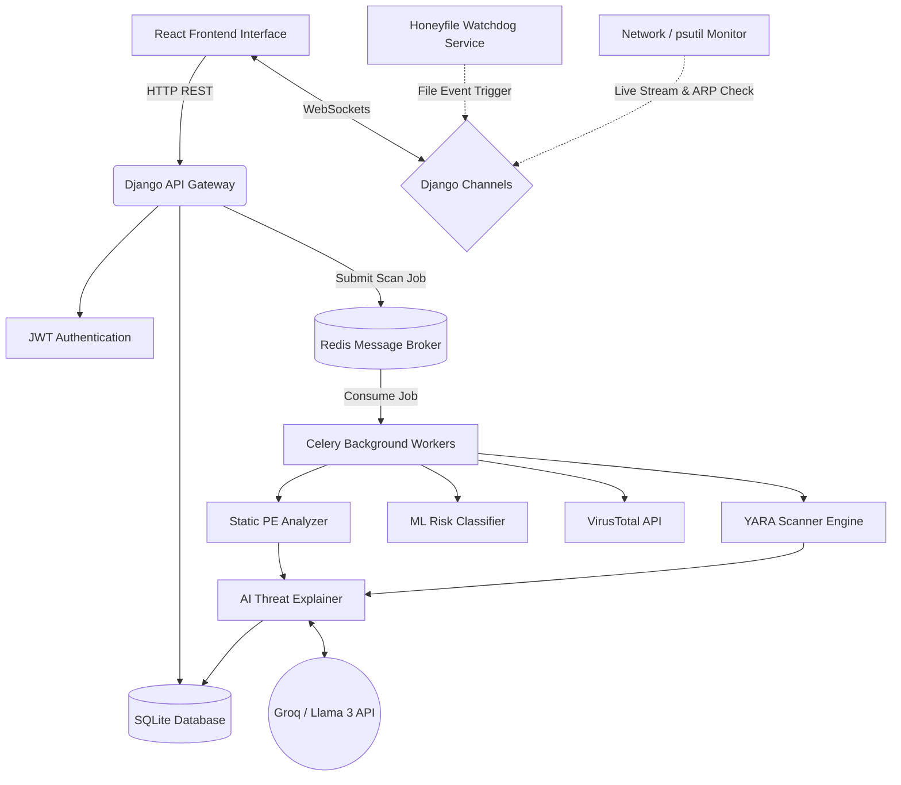

<div align="center">
  
  <h1 align="center">Ransomware Shield</h1>
  <p align="center">
    An AI-Powered, Real-Time Ransomware Detection and Mitigation Platform.
    <br />
    <a href="#key-features"><strong>Explore the features »</strong></a>
    <br />
    <br />
    <a href="#screenshots">Screenshots</a>
    ·
    <a href="#technical-architecture">Architecture</a>
    ·
    <a href="#installation">Installation</a>
  </p>
</div>

---

## 🛡️ About The Project

Ransomware Shield is a comprehensive, full-stack cybersecurity platform designed to protect endpoints from advanced ransomware and malware threats. It goes beyond traditional signature-based scanning by incorporating **Machine Learning**, **Real-Time Honeyfile Traps**, **Live Network Analysis (MitM Detection)**, and **Generative AI Threat Explanations** to provide a multi-layered defense mechanism.

Built with a scalable Django backend and a modern React frontend, this project is designed for both proactive network defense and post-incident analysis.

## ✨ Key Features & Modules

### 1. 🏗️ Static PE Analyzer
An advanced pipeline that analyzes Windows Executables (PE files) without executing them.
- **Suspicious API Detection:** Flags commonly abused Windows APIs (e.g., `CryptEncrypt`, `VirtualAlloc`, `vssadmin`).
- **Packer Identification:** Scans section headers to identify heavily obfuscated or packed executables (`.upx`, `.aspack`, etc.).
- **Anomaly Detection:** Flags compiler timestamp anomalies (e.g., files claiming to be compiled in 1992 or 2040) and calculates section entropy.

### 2. 🧬 YARA Scanner Engine
A highly optimized signature-matching engine.
- **Global Rule Caching:** Rules are compiled instantly on boot and cached in memory, massively improving throughput and reducing CPU bottlenecks.
- **ReDoS Protection:** Implements strict timeouts to prevent Regular Expression Denial of Service attacks from complex/malicious YARA rules.
- **Deep Metadata:** Extracts rule tags, authors, and descriptions for enhanced reporting.

### 3. 🧠 Machine Learning Classifier
A predictive model running alongside rule-engines.
- Uses `scikit-learn` (Random Forest Classifier) to dynamically predict whether a file is malicious based entirely on the features extracted by the Static PE Analyzer.

### 4. 🤖 Generative AI Threat Explainer
Translates complex cybersecurity data into plain English.
- Integrates **Groq (Llama 3 8B)** via LangChain.
- Ingests raw JSON scan data and YARA matches to generate a clear, non-technical explanation of the threat alongside strict remediation steps.

### 5. 🍯 Honeyfile/Honeypot Trap (Proactive Defense)
Active ransomware trap designed to catch zero-day encryption events instantly.
- A background `watchdog` service that spawns highly-enticing decoy files (e.g., `passwords.txt`, `finance_2025.xlsx`) in hidden directories.
- If an active ransomware process attempts to modify, move, or delete these files, the system instantly triggers a `CRITICAL` WebSocket alert across the entire frontend dashboard.

### 6. 🌐 Live Network & MitM Analysis
Real-time endpoint telemtry monitoring.
- Streams live TCP/UDP socket connections to the frontend via Django Channels.
- Actively checks local ARP tables to detect **Man-in-the-Middle (ARP Spoofing) Attacks** (e.g., when multiple IP addresses map to a single physical MAC address).

---

## 📸 Screenshots

| Dashboard Overview | Live Network Analysis |
| :---: | :---: |
|  |  |
| *High-level overview of threat scores and recent scans.* | *Real-time connection monitoring and ARP Spoofing alerts.* |

| AI Threat Explainer | Honeyfile Trap Alert |
| :---: | :---: |
|  |  |
| *Llama 3 translating YARA matches into plain English.* | *Global WebSocket alert triggered when a decoy file is modified.* |

*(Replace the placeholder URLs above with actual screenshots of the application)*

---

## 🛠️ Tech Stack

### Frontend Client
- **Framework::** React 18, Vite
- **Styling:** Tailwind CSS, PostCSS
- **State Management:** Zustand
- **Routing:** React Router v6
- **Charts/UI:** Recharts, Lucide React

### Backend API & Workers
- **Core Framework:** Django 4.2+, Django REST Framework (DRF)
- **WebSockets:** Django Channels, Daphne Server
- **Task Queue:** Celery, Redis (Broker/Backend)
- **Database:** SQLite3 (Configurable to PostgreSQL)
- **Security:** JWT Authentication (SimpleJWT)

### Analysis & AI Engines
- **Malware Analysis:** `yara-python`, `pefile`, `virustotal3`
- **Machine Learning:** `scikit-learn`
- **System Telemetry:** `psutil`, `watchdog` (File System Events)
- **Generative AI:** `langchain`, `langchain-groq`

---

## 🏗️ Technical Architecture



---

## 🚀 Installation & Setup

To get a local copy up and running, follow these steps.

### Prerequisites
- Python 3.10+
- Node.js (v18 or higher)
- Redis Server (Running on `localhost:6379`)
- API Keys for **VirusTotal** and **Groq**

### 1. Clone the Repository
```bash
git clone https://github.com/your-username/Ransomware_Shield.git
cd Ransomware_Shield
```

### 2. Backend Setup
```bash
cd backend

# Create and activate virtual environment
python -m venv venv
# On Windows: venv\Scripts\activate
# On Mac/Linux: source venv/bin/activate

# Install requirements
pip install -r requirements.txt

# Set up environment variables
# Create a .env file mimicking .env.example with your GROQ_API_KEY and VT_API_KEY

# Run Database Migrations
python manage.py migrate

# Create a Superuser (Optional)
python manage.py createsuperuser

# Start the Django/Daphne Server
python manage.py runserver
```

### 3. Background Services Setup (In separate terminal windows)
```bash
# Terminal 2 - Start Redis (if not running natively as a service)
# Make sure redis is active.

# Terminal 3 - Start the Celery Worker
cd backend
venv\Scripts\activate
# On Windows use pool=solo
celery -A config worker -l info --pool=solo

# Terminal 4 - Start the Honeyfile Ransomware Trap
cd backend
venv\Scripts\activate
python manage.py run_honeyfile
```

### 4. Frontend Setup (In a new terminal window)
```bash
cd frontend

# Install Node modules
npm install

# Start the Vite development server
npm run dev
```

Visit `http://localhost:5173` in your browser.

---

## 📄 License
Distributed under the MIT License. See `LICENSE` for more information.

<p align="center">Built with ❤️ for Cyber Defense</p>
